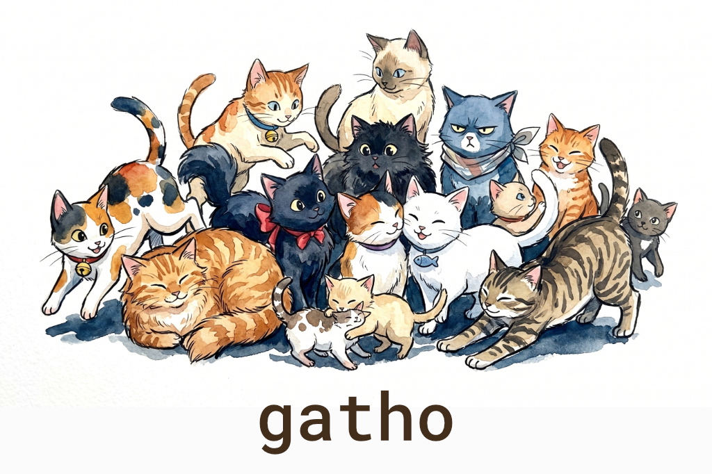

```bash
> npm install github:isaac-mason/gatho
# (npm coming soon!)
```

# gatho

gatho is a javascript multiplayer toolkit for building real-time games and applications.

> ⚠️ gatho is in early alpha. Browse and experiment freely, but expect breaking changes for now.

**Features**

- 🕹️ Multiplayer WebSocket rooms
- 🔄 Built-in reconnection with reliable message buffering
- 🧱 Separate process per room by default, with configurable room runners
- 📡 Horizontal scaling with Redis
- 🎯 Flexible SDK for matchmaking and room management
- 🔐 Seat tokens
- 🪶 Unopinionated. Adds value where it counts and stays out of your way everywhere else.

**API Documentation**

This readme has explanations, guides, and examples to get you started with gatho.

Auto-generated API documentation can be found at [gatho.dev/docs](https://gatho.dev/docs).

**Changelog**

See the [CHANGELOG.md](./CHANGELOG.md) for a detailed list of changes in each version.

## Table of Contents

- [Concepts](#concepts)
- [Quick Start](#quick-start)
- [Examples](#examples)
- [Server](#server)
- [Rooms](#rooms)
- [Messages](#messages)
- [Client](#client)
- [Drivers](#drivers)

## Concepts

A **room** (`gatho/room`) is a shared multiplayer session: a game match, a lobby, a collaborative space. Organise your application and state however you like, then call `create` to build the room and `await room.start()` to bring it online.

A **server** (`gatho/server`) hosts rooms. You run one or more of them, and each registers itself with the driver so the SDK knows it exists and can place rooms on it. You also tell the server how to run rooms. The built-in `subprocess()` runner spawns each room as its own child process, but you can run rooms in the same process, in a container, or anywhere else. Rooms report their health and status back to the server over a one-way notify channel, which is a Unix domain socket by default. The runner owns that channel, so a custom runner can carry it however its runtime needs. Run multiple servers when you want horizontal scale.

Your backend uses the **SDK** (`gatho/sdk`) to manage rooms. You can create, query, and destroy them, tag them for filtering, and call `join()` to mint a short-lived token URL that you hand to your client. Tags and client data give you enough to build whatever matchmaking logic you need.

The **driver** (`gatho/driver`) is the shared state store that lets multiple server instances coordinate. It can be Redis or in-memory.

## Quick Start

First, write a simple room that counts connections and messages:

```ts
// counter-room.ts
import { auth, create } from 'gatho/room';

let count = 0;

const room = create({
    onAuth: () => auth.ok(),

    onJoin: (client) => {
        client.send(JSON.stringify({ type: 'count', count }));
    },

    onMessage: (_client, message) => {
        if (typeof message !== 'string') return;

        const parsed = JSON.parse(message) as { type: 'increment' | 'decrement' };

        if (parsed.type === 'increment') {
            count++;
        } else if (parsed.type === 'decrement') {
            count--;
        }

        room.broadcast(JSON.stringify({ type: 'count', count }));
    },
});

await room.start();
```

Start a gatho server with a driver and tell it how to run your rooms:

```ts
// server.ts
import { createRedisDriver } from 'gatho/driver/redis';
import { start, subprocess } from 'gatho/server';

const driver = createRedisDriver({ url: 'redis://localhost:6379' });

await start({
    rooms: {
        counter: subprocess(['bun', 'run', './counter-room.ts']),
    },
    driver,
    roomEndpoint: ({ port }) => `ws://localhost:${port}`,
});
```

Then you can start rooms using the `gatho/sdk`:

```ts
// my-backend.ts
import { createRedisDriver } from 'gatho/driver/redis';
import { createGathoSDK } from 'gatho/sdk';

const gatho = createGathoSDK({ driver: createRedisDriver() });

const servers = await gatho.getServers({ roomTypes: ['counter'] });

if (servers.length === 0) {
    throw new Error('no servers available to run a counter room');
}

const room = await gatho.createRoom({
    type: 'counter',
    serverId: servers[0].serverId,
    // data and tags are optional (default {}) — pass them to seed the room's
    // create() data or to categorize the room for later filtering.
});

// ttl is optional too (default 30000ms) — how long the reservation stays valid.
const seat = await gatho.join({ roomId: room.roomId });

console.log(seat.url);
```

And you can connect to URLs returned by `join()` with `gatho/client`:

```ts
// client.ts
import { connect } from 'gatho/client';

const url = new URLSearchParams(window.location.search).get('url')!;

const room = connect(url, {
    onMessage: (msg) => {
        if (typeof msg !== 'string') return;
        const { count } = JSON.parse(msg) as { count: number };
        console.log('count:', count);
    },
});

room.send(JSON.stringify({ type: 'increment' }));
```

## Examples

- [**chat**](./examples/chat): a onebox chat app (one process, in-memory driver). Good for getting started and seeing how the pieces fit together without any infra.
- [**ha**](./examples/ha): demonstrates multiple gatho servers sharing state via Redis, with a separate REST backend and Caddy in front. It has the shape of a production setup but is meant to be run locally for experimentation.

## Server

`gatho/server` is the host process for your rooms. When starting a server you tell it how to run different types of rooms, and it takes care of placement, spawning, health tracking, and shutdown. Run multiple instances against the same driver (e.g. Redis) for horizontal scale.

With a networked driver, each server publishes its own `serverEndpoint` to its peers and to the SDK. Set it to a URL the rest of your fleet can reach (e.g. `http://10.0.0.5:3000`) — the default derived from a wildcard bind (`0.0.0.0`) is unroutable and would make servers evict each other, so `start()` fails fast in that case. A single-process onebox on the in-memory driver needs no `serverEndpoint`.

### Runners

A runner knows how to start and stop a single room. The server calls it once per room assignment. The callback you pass to `runner()` does four things:

1. It receives a context with room metadata (`ctx.roomId`, `ctx.data`, `ctx.env`), an `onMessage(msg)` callback (the server's notify-message handler), and a `stopped(code)` callback.
2. It establishes a notify channel that the room reports back on. Compose a helper like `notify.uds(ctx)` (see below), or call `ctx.onMessage` directly to synthesize messages on the room's behalf, such as an `error` when a spawn fails.
3. It spawns the room however you like: child process, container, in-process worker, whatever suits you.
4. It returns a destructor that the server invokes to stop the room.

Call `ctx.stopped(code)` whenever the room exits (crash, clean exit, killed) so the server can reconcile. The destructor owns the shutdown strategy, whether that is graceful escalation, a single API call, or whatever fits your runtime.

`ctx.env` contains the standard `GATHO_*` environment variables pre-built for the room (room id, type, server id, secret), ready to spread into a process env or pass as docker `-e` flags. The notify channel contributes its own env var (`GATHO_NOTIFY_SOCKET`) through the channel helper, so spread `chan.env` alongside `ctx.env`.

#### Child processes with `subprocess()`

`subprocess()` is a factory for the common case. Give it the argv and it returns a runner that spawns a node/bun child process. It sets up a `notify.uds` channel, forwards the standard `GATHO_*` env, wires exit signalling, and handles graceful shutdown (SIGTERM first, then SIGKILL if that doesn't take). Use `options.env` for extra env vars, and `options.socketDir` or `options.killTimeoutMs` to tune the channel and shutdown. Per-room `ctx.data` isn't forwarded automatically, so reach for a custom runner when you need that.

```ts
import { createMemoryDriver } from 'gatho/driver';
import { start, subprocess } from 'gatho/server';

await start({
    rooms: {
        // subprocess() is a factory: give it the argv and it returns a runner.
        // options.env adds extra env vars alongside the standard GATHO_* set.
        game: subprocess(['bun', 'run', './game-room.ts'], {
            env: { REGION: 'eu-west' },
        }),
    },
    driver: createMemoryDriver(),
    roomEndpoint: ({ port }) => `ws://localhost:${port}`,
});
```

#### Custom runners

For Docker, microVMs, or any other runtime, write the runner body directly. Compose a notify channel with `notify.uds(ctx)` (or call `ctx.onMessage` yourself), spread `chan.env` into the room's environment, and close the channel when the room exits. The destructor only needs to stop whatever you spawned. Per-room `ctx.data` is available here, so this is also where you forward room-specific config.

```ts
import { spawn } from 'node:child_process';
import { createRedisDriver } from 'gatho/driver/redis';
import { notify, runner, start } from 'gatho/server';

// host and container share this dir so the socket path resolves inside the
// container. it's a notify.uds option now, not a server-wide one.
const SOCKET_DIR = '/tmp/gatho-ipc';

const dockerRunner = runner(async (ctx) => {
    const gameMode = String(ctx.data.gameMode ?? 'classic');

    // establish the notify channel: a uds the room dials back on to report
    // heartbeats and client presence. chan.env carries GATHO_NOTIFY_SOCKET, and
    // chan.socketDir is this room's own socket dir to bind-mount.
    const chan = await notify.uds(ctx, { socketDir: SOCKET_DIR });

    const child = spawn('docker', [
        'run',
        // remove the container when it exits
        '--rm',
        // use host networking (simpler setup, you could also do port mapping)
        '--network=host',
        // give the container a name for easier debugging
        '--name', `room-${ctx.roomId}`,
        // limit memory
        '--memory', '512m',
        // limit CPU
        '--cpus', '1',
        // mount only THIS room's socket dir so the room can reach its own socket
        // but not sibling rooms' sockets.
        '-v', `${chan.socketDir}:${chan.socketDir}`,
        // forward gatho env + the notify channel env to the container
        ...Object.entries({ ...ctx.env, ...chan.env }).flatMap(([k, v]) => ['-e', `${k}=${v}`]),
        // set a game mode env var for the container based on ctx.data
        '-e', `GAME_MODE=${gameMode}`,
        // our docker image, runs gatho/room's create() + room.start() within
        'my-game-image:latest',
    ], { stdio: ['ignore', 'inherit', 'inherit'] });

    // when the child exits, tear down the channel and tell the server the room stopped
    child.on('exit', (code) => {
        chan.close();
        ctx.stopped(code);
    });

    // destructor that stops the container
    return () => {
        child.kill('SIGTERM');
        const timer = setTimeout(() => child.kill('SIGKILL'), 10_000);
        timer.unref();
    };
});

await start({
    rooms: { game: dockerRunner },
    driver: createRedisDriver({ url: 'redis://localhost:6379' }),
    roomEndpoint: ({ port }) => `wss://my-host/${port}`,
    tags: { region: 'example', foo: 'bar' },
});
```

### The notify channel

Rooms report to their parent server over a one-way **notify channel**. They send ready signals, heartbeats, and client connect/disconnect events, and the server never pushes back over it. Stop is delivered out-of-band through the runner's destructor instead. The runner owns the channel: built-in runners set one up for you, and custom runners compose a helper.

The default helper, `notify.uds(ctx)`, is a Unix domain socket, one per room, created at `socketDir/<roomId>/sock`. (`socketDir` defaults to `${os.tmpdir()}/gatho-ipc` and can be overridden via the helper's options.) A UDS is local-only: no TCP/IP stack, no port allocation, no handshake, no TLS, just a file on disk that the kernel routes through. That keeps latency and overhead low, speeds up room startup, and keeps the IPC channel off the network entirely. The only port a room opens is the public WebSocket port that clients connect to.

The helper returns `chan.env`, which holds `GATHO_NOTIFY_SOCKET` (a `uds:<path>` URI). Spread that into the room's environment. When running rooms in a sandbox (Docker, microVM, etc.), bind-mount `chan.socketDir` into the container so the socket path resolves on both sides. The custom runner snippet above shows how.

## Rooms

`gatho/room` is the runtime for a single multiplayer session: a game match, a lobby, a collaborative space. You supply lifecycle callbacks (auth, join, message, drop, reconnect, leave, shutdown) and get back a handle for sending messages to connected clients and broadcasting to all of them.

### Lifecycle

```ts
import { auth, create } from 'gatho/room';

const room = create({
    // return auth.ok(data) to accept, auth.fail(reason) to reject.
    // callbacks close over `room` — no room parameter is passed.
    onAuth: (joinData: { displayName: string }) => {
        if (room.clients.count() >= 10) return auth.fail('room is full');
        return auth.ok({ displayName: joinData.displayName });
    },

    // client is authenticated and in the room
    onJoin: (client) => {
        room.broadcast(JSON.stringify({ type: 'joined', id: client.id }));
    },

    // client sent a message
    onMessage: (client, message) => {
        if (typeof message !== 'string') return;
        room.broadcast(JSON.stringify({ type: 'echo', from: client.id, message }));
    },

    // non-consented disconnect: call allowReconnection to hold the seat
    onDrop: (client) => {
        client.allowReconnection(30_000);
    },

    // client reconnected within the window; buffered messages already flushed
    onReconnect: (client) => {
        client.send(JSON.stringify({ type: 'welcome-back' }));
    },

    // client permanently left: consented close, eviction, or window expired
    onLeave: (client) => {
        room.broadcast(JSON.stringify({ type: 'left', id: client.id }));
    },

    // SIGTERM or room.stop()
    onShutdown: () => {
        console.log('shutting down');
    },
});

await room.start();
```

### Running Rooms Standalone

By default a room expects to be spawned by a gatho server. It reads `GATHO_*` env vars (set automatically when using `subprocess()`), or takes the same values via `options.server` when you are using a custom runner. It opens a Unix domain socket (UDS) back to the parent server to report heartbeats and client connects/disconnects, and it verifies seat tokens minted by `sdk.join()` on every new connection. `create()` throws if no managed context is detected, so a mis-deployed room can't silently accept unauthenticated connections.

A room is two-phase: `create(options)` builds the room synchronously (resolving config, storing your handlers, exposing `room.roomId` immediately), and `await room.start()` brings it online (dialing the notify channel, opening the transport, signalling ready). Lifecycle callbacks are passed to `create()` and no longer receive a `room` argument — reference the `room` handle returned by `create()` directly, and use the per-client verbs `client.send()`, `client.allowReconnection()`, and `client.disconnect()` on the client handle.

For local dev or tests where you want to `bun run room.ts` and connect a client directly, pass `standalone: true`. The room picks a random `roomId`, skips the UDS, and accepts any connection.

```ts
import { auth, create } from 'gatho/room';

// opt in to standalone mode, which skips jwt auth and ipc.
// create() throws if `standalone` is omitted and no GATHO_* env vars are set.
const room = create({
    standalone: true,
    port: 8080,
    onAuth: () => auth.ok(),
    onMessage: (client, message) => client.send(message),
});

await room.start();
```

## Messages

gatho is unopinionated about message format. `client.send()` and `room.broadcast()` accept `string | ArrayBuffer | ArrayBufferView`, and `onMessage` receives `string | ArrayBuffer`. For JSON, call `JSON.stringify()` and `JSON.parse()` yourself. gatho stays out of the way.

If you want good performance without sacrificing developer experience, [packcat](https://github.com/isaac-mason/packcat) plays well with gatho. Define schemas once, share them between client and server, and get compact binary encoding with full TypeScript types. No code generation, no IDL files.

```ts
// shared/protocol.ts

// define your message schemas once, use them on both client and server

import * as p from 'packcat';

// client → server
const PlayerInput = p.object({
    type: p.literal('input'),
    movement: p.list(p.float32()),
});

// server → client
const GameState = p.object({
    type: p.literal('snapshot'),
    tick: p.varuint(),
    players: p.list(
        p.object({
            id: p.varuint(),
            position: p.list(p.float32(), 2), // [x, y]
        }),
    ),
});

const ServerMessage = p.union('type', [GameState]);
const ClientMessage = p.union('type', [PlayerInput]);

export type ServerMessage = p.SchemaType<typeof ServerMessage>;
// { type: 'snapshot', tick: number, players: { id: number, position: [number, number] }[] }

export type ClientMessage = p.SchemaType<typeof ClientMessage>;
// { type: 'input', movement: [number, number] }

const ServerMessageSerDes = p.build(ServerMessage);
const ClientMessageSerDes = p.build(ClientMessage);

const exampleServerMessage: Uint8Array<ArrayBufferLike> = ServerMessageSerDes.pack({
    type: 'snapshot',
    tick: 123,
    players: [
        { id: 1, position: [10, 20] },
        { id: 2, position: [30, 40] },
    ],
});

console.log('packed server message:', exampleServerMessage);

const unpackedServerMessage: ServerMessage = ServerMessageSerDes.unpack(exampleServerMessage);
console.log('unpacked server message:', unpackedServerMessage.tick, unpackedServerMessage.players);

const exampleClientMessage: Uint8Array<ArrayBufferLike> = ClientMessageSerDes.pack({
    type: 'input',
    movement: [1, 0],
});

console.log('packed client message:', exampleClientMessage);

const unpackedClientMessage: ClientMessage = ClientMessageSerDes.unpack(exampleClientMessage);
console.log('unpacked client message:', unpackedClientMessage.movement);
```

## Client

`gatho/client` is a thin WebSocket wrapper that handles the things you'd otherwise build yourself. `connect(url, handlers)` takes a single-handler bag — one callback per event (`onOpen`, `onMessage`, `onDrop`, `onReconnect`, `onAuthError`, `onClose`, `onError`), all optional — and returns a connection with `send()`, `close()`, `state`, and `clientId`:

- **Automatic reconnection.** On an unexpected disconnect the client enters a `reconnecting` state and retries with exponential backoff and jitter.
- **Reliable messaging.** Messages sent while reconnecting are buffered (up to 1MB by default) and flushed in order once the connection is restored. Mark a message as `{ reliable: false }` to drop it instead. WebTransport support will build on this.
- **Session continuity.** The server issues a session token on first connect. On reconnect the client presents it automatically, so the server sees the same `clientId` and can resume where it left off.
- **Clean close.** `close()` sends a protocol-level leave message so the server knows the disconnect was intentional and skips the reconnection window.

On the server side, opt in to reconnection by calling `client.allowReconnection(windowMs)` inside `onDrop`. Reliable messages sent to a disconnected client are buffered (up to `maxBufferBytes`, default 1MB) and flushed automatically on reconnect. If the buffer overflows or the window expires, the client is evicted and `onLeave` fires.

The client's `onOpen` handler and the room's `onJoin` fire at the same protocol instant — receipt of the session message — so "joined" means the same thing on both ends.

**Outbound backpressure.** Gatho exposes each socket's unflushed outbound buffer via `client.bufferedAmount` but ships no automatic eviction policy — bursty payloads (a voxel world sync) must not be killed by a threshold gatho guessed at, so the pacing and eviction decisions are yours. A full guide to pacing large sends and building your own stall policy is coming.

```ts
import { auth, create } from 'gatho/room';

const room = create({
    onAuth: () => auth.ok(),

    onDrop: (client) => {
        client.allowReconnection(30_000); // hold seat for 30s
    },

    onReconnect: (client) => {
        client.send(JSON.stringify({ type: 'welcome-back' }));
    },
});

await room.start();
```

## Drivers

Drivers provide the shared state backend used by the server and SDK.

- `createMemoryDriver()` (from `gatho/driver`): useful for local dev, tests, and onebox deployments
- `createRedisDriver({ url })` (from `gatho/driver/redis`): requires Redis. `ioredis` is an optional peer dependency — install it (`npm i ioredis`) only when you use this driver; `gatho/driver` (memory driver, types, errors) never pulls it in.
